

# Quick Combat module for FVTT
Adds the ability to add a Combat Playlist. Whenever you start combat the playlist will start.
 * **NEW Feature!** You can now define any number of playlists Combat/Boss/Mini Boss whatever fits your needs. Works best with the `Choose Playlist Settings. You can even define playlists for specific scenes!
 * **NOTE*** The module will make its best attempt to migrate the old playlist settings over to the new system. You should make sure your playlists are setup correctly

Adds Auto Experience Tracking. When NPCs are defeated it will add the experience to PCs.

Adds a Hotkey to quickly add PCs, and NPCs to the combat tracker, roll their initiatives, and start combat.

Includes a compendium of character features to exclude actors from combat.

Optional Feature to display Current Turn and On Deck Markers on tokens. This feature will only be displayed if you have the following additional modules enabled:
* [Sequencer](https://github.com/fantasycalendar/FoundryVTT-Sequencer)
* [Jules&Ben's Animated Assets](https://github.com/Jules-Bens-Aa/JB2A_DnD5e)

## Current Game System Support
This module has been tested with the systems listed below. Plan is to make it available to other systems in the future. For other systems, everything except the Experience tracking should work, but this has not been tested yet.

* [D&D 5e](https://gitlab.com/foundrynet/dnd5e)
* [OSE](https://github.com/vttred/ose)
* [PF2e](https://github.com/foundryvtt/pf2e/)

## How To Use Quick Combat

### Settings

* The following playlist settings have been moved and no longer available:
  * ~~**Combat Playlist**~~ - select from a list of playlists to play when starting combat, or None to not change the playlist.
  * ~~**Fanfare Playlist**~~ - select from a list of playlists to play when combat ends, will randomly select a track to play.
  * ~~**Boss Combat Playlist**~~ - select from a list of playlists to play when starting combat, or None to not change the playlist. This is separate from the Combat Playlist.
* **Setup Combat playlists** - A new window will open where you can create your Combat Playlist settings. You can have any number of playlists defined for any number of scenes or no scenes. If you have multiple playlists defined, it is recommended to enable the `Choose Playlist` option, otherwise a **Random** playlist will be chosen to start. (see below for more info)
  * **Playlist** - select from a list of playlists to play when starting combat
  * **Scene** - only play the playlist on a specific scene, this means the playlist will only be played on that scene and no where else
  * **Fanfare** - if a Fanfare playlist check this box, this will only be played after combat has ended. It will select a random track to be played once.
  * **Remove** - remove a playlist option
  * **Save** - save playlist options
  * **Add** - add a new playlist option
* **Only Roll Initiative for NPCs?** - When adding combatants to the combat tracker, only roll for NPCs and not PCs. If your players like to roll their own initiatives. Doesn't do anything for the OSE system.
* **Combat Experience Tracking** - (DND5E/OSE Only!) For any defeated NPCs will add any experience and for all PCs in combat will add any gained experience.
* **GM Experience Whisper** - Only Message the GM the experience gained.
* **PF2E Auto Initiative** (PF2e Only!) Change what method to roll initiatives, Default = System Default, Fast = Roll Perception for every NPC and PC no dialogs, Prompt = Present Dialogs to Players and GM to choose Initiative type, Fast/Prompt = Roll Perception for NPCs and Prompt Players.
* **Remove Defeated NPCs?** - Will delete any of the defeated NPC tokens from the scene.
* **Enable Combat Markers?** - (Only Available with Jules&Ben's Animated Assets and Sequencer Modules) Adds combat markers to current token and on deck token.

### Keybind Settings

Under the Configure Control Settings Menu is located a **Quick Combat** Action Category. Where the Combat Toggle Keybind setting is now located. This can be changed as before.

**NOTE** Due to the way this Foundry setting works I had to change the default keybind from `Shift + C` to `Alt + C`.

### Pets and Summons (DND5e Only)
Included with the module is a compendium of features Pet and Summon.

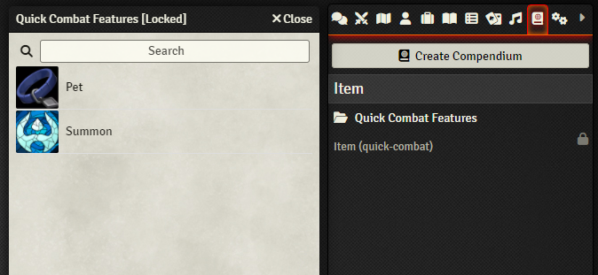

If any character sheet has either of these Features included into them they will **NOT** be included in the combat tracker.

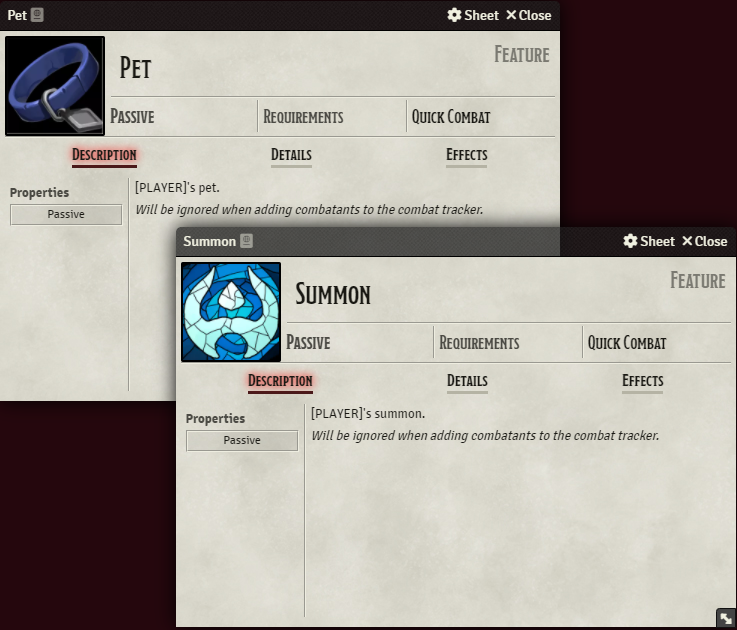

### Start Combat

Select all tokens for combat.

Hit the Combat Toggle Keybind hot key.

**If enabled:** A Window will pop up asking which playlist to start. Select which playlist to start or None/Close to start no playlist and continue the same as before.

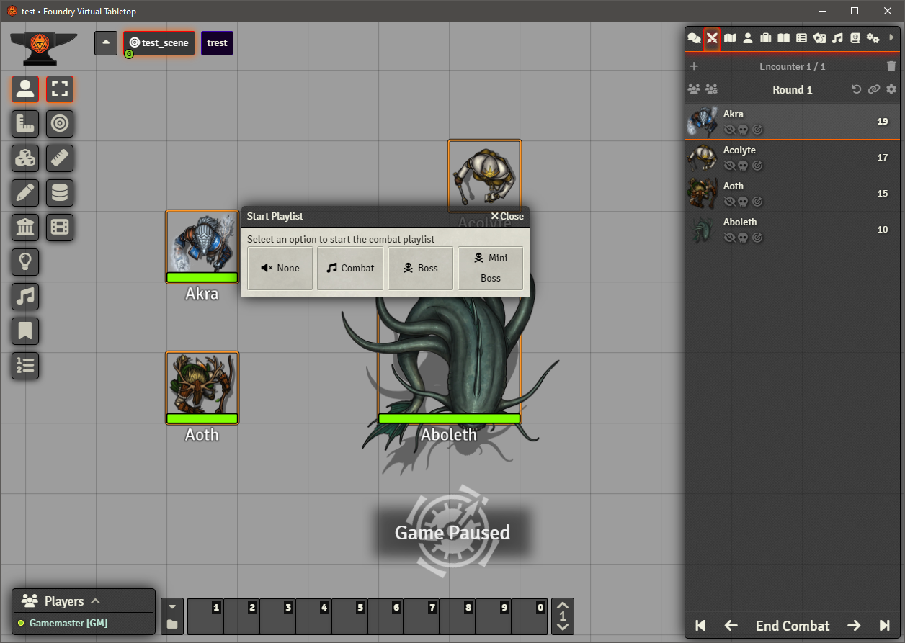

If you have set any playlists in the settings they will appear here.

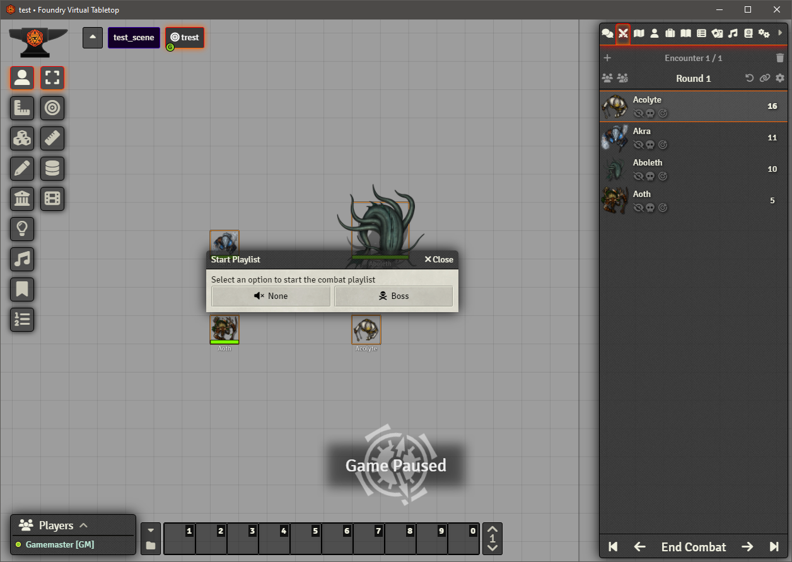

If you have set any playlist that is tied to a scene they will **only** be available for that scene.

Adds all selected tokens to combat tracker, rolls all tokens initiatives, starts combat.

### End Combat

Hit the Combat Toggle Keybind hot key, a warning will pop up to make sure it wasn't an accident.

Will remove all combatants, and if experience tracking was enabled (for the available systems) it will find all defeated NPCs, calculate experience and display a chat box with all PCs experience.

### Setup Combat Playlist Example

Open the Quick Combat Playlist window to configure any number of playlists.
* If you have multiple playlists defined for any scene or no scenes it is recommend to enable the Choose Playlist option. Otherwise a random playlist will be chosen to start when combat starts.

Start Combat.

Stop Combat and will start the "Background" playlist again.

### Fanfare Playlist
Fanfare Playlist will only play at the end of combat. It will randomly select a track and play it once. After the track is done playing the playlist that was playing before combat started will start again.

It is recommended that you set up the playlist using the `Soundboard Only` Playback Mode as shown below. You can also set the Fade Duration for any track if you require it. You can also limit Fanfare playlists by scenes.

### NPC Rolling Only

If set up will only roll for NPC combatants and not PCs.

### Remove Defeated

Remove any of the defeated NPC combatants tokens from the Scene.

Before

After

### Combat Markers
Combat Markers will only work if the following modules are enabled:
* [Sequencer](https://github.com/fantasycalendar/FoundryVTT-Sequencer)
* [Jules&Ben's Animated Assets](https://github.com/Jules-Bens-Aa/JB2A_DnD5e)

Adds an animated icon to the Current Active Turn Token and the On Deck Token.
* Current Token is the Yellow animated image
* On Deck is the Blue animated image

**NOTES**
* The On Deck marker will skip any defeated combatants
* Any hidden (sneaking) tokens will be skipped from being marked. I haven't found a good way to make the animation hidden just yet.

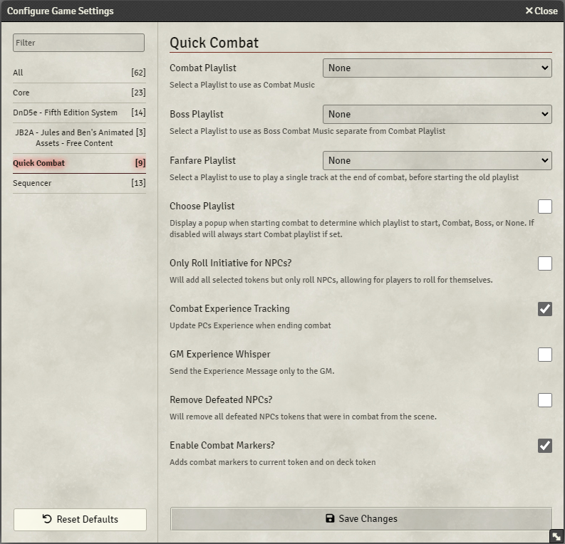

Once Combat has started and every time the next turn button is clicked the Current/On Deck markers will move to the respected tokens

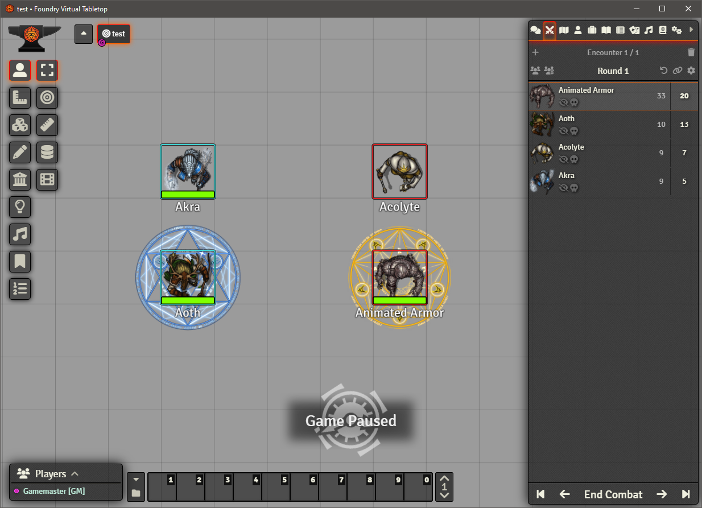

The combat Markers will skip any defeated combatants when finding the On Deck Marker

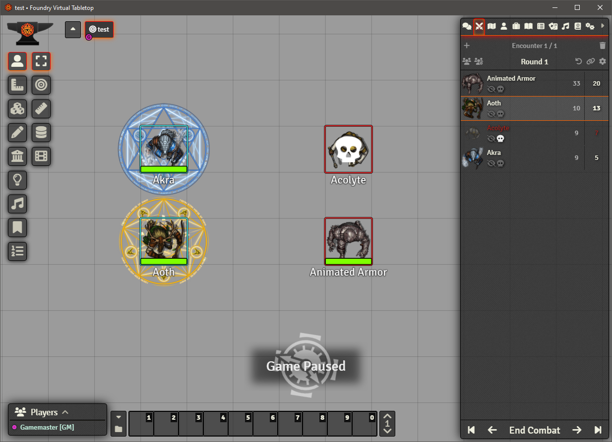

The Combat Markers will ignore any hidden token, if token becomes visible the animation will not be applied until next turn.

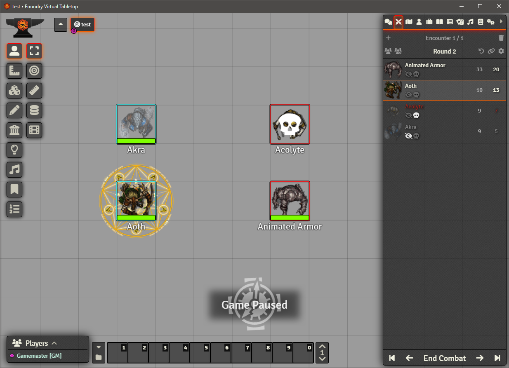

### Pathfinder Second Edition - Skip Dialog
Pathfinder has an additional setting available to it, when rolling for initiative the system will display a dialog:

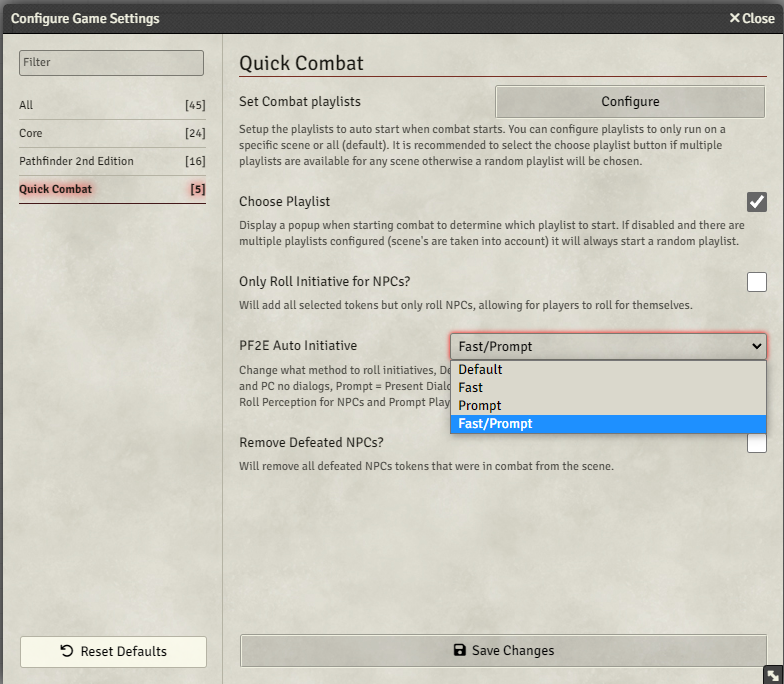

This setting will enable how initiatives will be automated
* Default - The system default, will prompt the GM with a dialog to modify each roll.
* Fast - All NPCs and PCs will be rolled with the default Perception initiative
* Prompt - Will Prompt Both GM and Players to select an initiative type to roll
* Fast/Prompt - Will Prompt the Players to select an initiatives type to roll and roll all NPCs with the default Perception initiative

#### Default
With the Default Auto initiative setting, the GM will see the default prompts
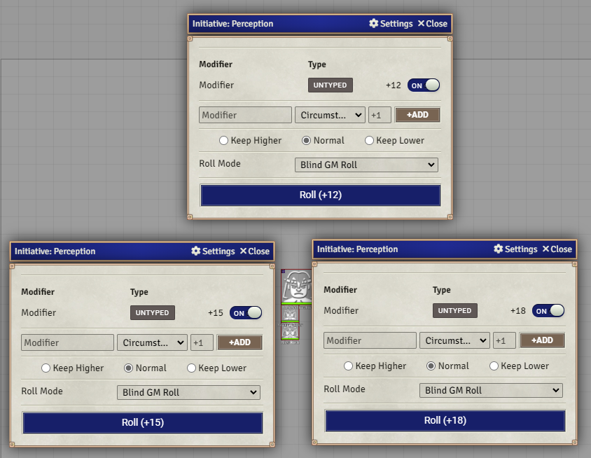

#### Fast
With the Fast Auto initiative setting, the GM and Players will see no prompt and every NPC and PC will roll Perception.
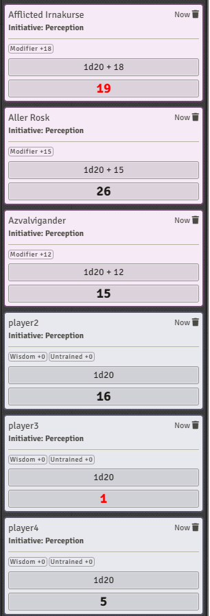

#### Prompt
With the Prompt Auto initiative setting, the GM and Players will see a prompt asking for the initiative type to roll. If any player is not connected at the time, the roll prompt will go to the GM.

Player view
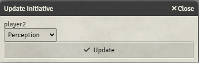

GM View
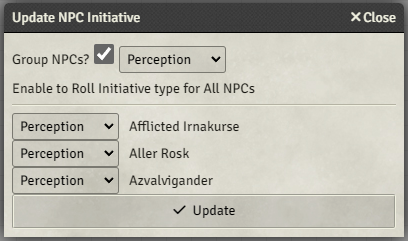

The GM has options to roll all of the NPCs as the same initiative type by selecting the `Group NPCs?` prompt. However the NPCs need to roll different initiatives unselecting that checkbox and setting each NPC initiative from the list below will make that NPC roll the selected initiative.

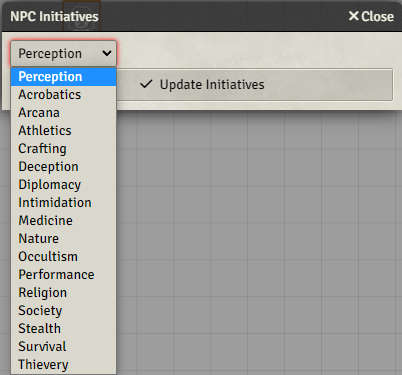

#### Fast/Prompt
With Fast/Prompt Auto initiative setting, it will roll all NPCs with the Perception initiative, and every Player will see a prompt asking for the initiative type to roll. If any player is not connected at the time, the roll prompt will go to the GM.
